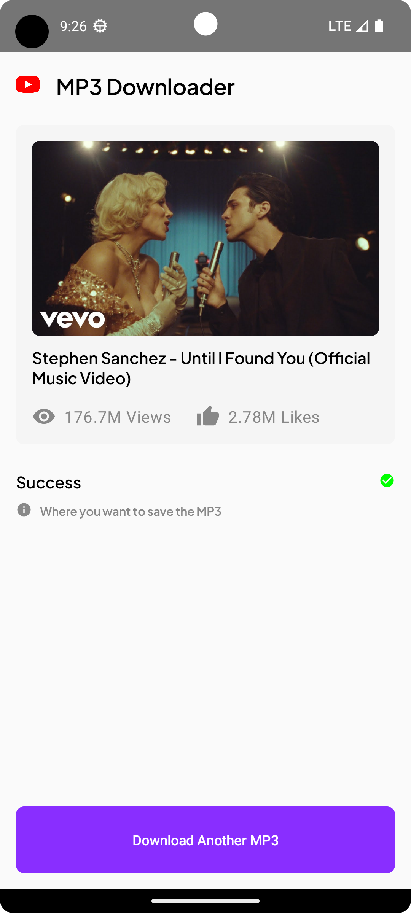
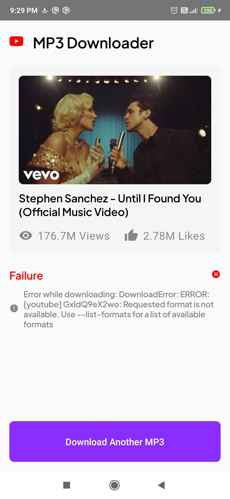

# MP3-Downloader


Youtube to MP3 Coverter app

# 📷 Previews
Download [apk](https://github.com/gargVader/MP3-Downloader/releases/download/1.0.0/MP3.Downloader.apk)

[Demo video 📹](https://drive.google.com/file/d/1-YjZ-U3ahWhUnb6o7zKZZAunZsYEDiAM/view?usp=sharing)

<p align="center">
  
  
  
  
  
  
  
</p>

# 🛠 Tech Stacks & Open Source Libraries

- Jetpack Compose
- ViewModel
- Hilt
- Moshi
- [Chaquopy](https://chaquo.com/chaquopy/doc/current/android.html) : To create an environment to run .py script
- [mobile-ffmpeg](https://github.com/tanersener/mobile-ffmpeg) : To convert .m4a to mp3
- [yt-dlp](https://github.com/yt-dlp/yt-dlp) : To download .m4a audio from youtube

# ⭐ Key features
- **Grabbing & Downloading** : Chaquopy used to create an environment for running [main.py](https://github.com/gargVader/MP3-Downloader/blob/6f34c2763e5465450eef0389a404804cf18e9bb3/app/src/main/python/main.py). 
It contains `get_video_info()` to grab video info and `download_audio()` to download m4a audio. During download, it also returns invokes a callback to log progress on Android side.
- **Converting** Ffmpeg command to convert file
```bash
ffmpeg -i $inputFile -c:v copy -c:a libmp3lame -q:a 4 $outputFile
```
- [**Saving**](https://github.com/gargVader/MP3-Downloader/blob/6f34c2763e5465450eef0389a404804cf18e9bb3/app/src/main/java/com/example/mp3downloader/presentation/home_screen/HomeScreen.kt#L62): Input and output streams used 

# 🤔 Key challenges faced
- **UI related** <br>
❓ Creating multiple screens vs single screen <br>
❓ Architecturing the UI for different steps <br>
💪 **Solution**: Broke down the UI into state machine. During a session, the app is always in one of the following [`HomeScreenStep`](https://github.com/gargVader/MP3-Downloader/blob/6f34c2763e5465450eef0389a404804cf18e9bb3/app/src/main/java/com/example/mp3downloader/presentation/home_screen/HomeScreenState.kt#L21)

- **yt-dlp related** <br>
❓ How to use yt-dlp (python) in Android project <br>
❓ Understanding yt-dlp and creating script for it <br>
❓ How to send progress of download to Android <br>
💪 **Solution**: Used Chaquopy and yt-dlp's doc

- **ffmpeg related** <br>
❓ How to use ffmpeg in Android project <br>
❓ Ffmpeg command to convert file <br>
💪 **Solution**: Used mobile-ffmpeg and ffmpeg's doc

# ⭐ Possible Improvements
- Could have added tests
- Could have polished the UI

# File structure

<details>
    <summary>Click me</summary>

  ```
MP3 Downloader
│   AndroidManifest.xml
│
├───java
│   └───com
│       └───example
│           └───mp3downloader
│               │   App.kt
│               │   MainActivity.kt
│               │
│               ├───data
│               │   └───model
│               │           DownloadProgressInfo.kt
│               │           VideoInfo.kt
│               │
│               ├───di
│               │       AppModule.kt
│               │
│               ├───presentation
│               │   ├───common
│               │   │   │   DestinationFolderItem.kt
│               │   │   │   DownloadButton.kt
│               │   │   │   ScreenHeader.kt
│               │   │   │   TextFieldItem.kt
│               │   │   │   VideoInfoItem.kt
│               │   │   │
│               │   │   └───step_content
│               │   │           ConvertingStepContent.kt
│               │   │           DownloadingStepContent.kt
│               │   │           FailureStepContent.kt
│               │   │           SavingStepContent.kt
│               │   │           SuccessStepContent.kt
│               │   │
│               │   └───home_screen
│               │           HomeScreen.kt
│               │           HomeScreenEvents.kt
│               │           HomeScreenState.kt
│               │           HomeViewModel.kt
│               │
│               └───ui
│                   └───theme
│                           Color.kt
│                           Theme.kt
│                           Type.kt
│
├───python
│       main.py
│
└───res
    ├───drawable
    │       ic_launcher_background.xml
    │       yt_logo.png
    │
    ├───drawable-v24
    │       ic_launcher_foreground.xml
    │
    ├───font
    │       plus_jakarta_sans_bold.ttf
    │       plus_jakarta_sans_semibold.ttf
    │
    ├───mipmap-anydpi-v26
    │       ic_launcher.xml
    │       ic_launcher_round.xml
    │
    ├───mipmap-hdpi
    │       ic_launcher.webp
    │       ic_launcher_round.webp
    │
    ├───mipmap-mdpi
    │       ic_launcher.webp
    │       ic_launcher_round.webp
    │
    ├───mipmap-xhdpi
    │       ic_launcher.webp
    │       ic_launcher_round.webp
    │
    ├───mipmap-xxhdpi
    │       ic_launcher.webp
    │       ic_launcher_round.webp
    │
    ├───mipmap-xxxhdpi
    │       ic_launcher.webp
    │       ic_launcher_round.webp
    │
    ├───values
    │       colors.xml
    │       strings.xml
    │       themes.xml
    │
    └───xml
            backup_rules.xml
            data_extraction_rules.xml
  ```

</details>

